# Вьетнам — Нячанг / Камрань · Памятка путешественника

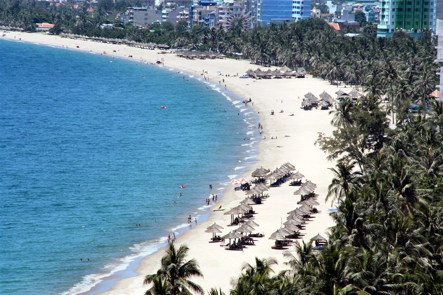

> **7–15 сентября 2026** · Отель: Radisson Blu Resort, Cam Ranh (пляж Бай Дай)
> **Туда:** SU 294 Шереметьево → Камрань, 07.09 в 19:20 · **Обратно:** SU 295 Камрань → Шереметьево, 15.09 в 11:30
> Трансфер: групповой автобус

---

## 1. Перелёт

### 1.1. Расписание

| | Туда | Обратно |
|---|---|---|
| Рейс | SU 294 (Аэрофлот) | SU 295 (Аэрофлот) |
| Дата | 07.09.2026, вылет 19:20 | 15.09.2026, вылет 11:30 |
| Аэропорт | Шереметьево (SVO) | Камрань (CXR) |
| Прилёт | Камрань **08.09 утром ~10:00** по местному | Шереметьево **15.09 ~18:00** по Москве |

- Время в полёте ~10.5–11 часов, разница с Москвой +4 часа.
- Внимание: из-за разницы часовых поясов **прилетаешь в Камрань утром 8 сентября**, хотя вылет 7-го вечером. Первый «полный» день в отеле — 8-е.
- Точно по билету сверь время прилёта в маршрут-квитанции.

### 1.2. Шереметьево (туда)

- Аэрофлот, международные рейсы — **терминал C** (проверь по табло, иногда меняют). Приезжай за **3 часа** до вылета (~16:20).
- Онлайн-регистрация в приложении Аэрофлота открывается за 24 часа — займи место заранее, в аэропорту останется только сдать багаж.
- Нормы эконом-класса: багаж 23 кг + ручная кладь 10 кг + небольшая сумка. В ручную кладь — документы, деньги, аптечку, повербанк (в багаж повербанк нельзя), дождевик.
- Жидкости в ручной клади — до 100 мл в ёмкости, суммарно 1 л.
- Возьми с собой зарядку и наушники — на длинном рейсе пригодятся, в самолёте есть розетки/USB.

### 1.3. Прилёт в Камрань (CXR)

- Пограничный контроль: штамп по безвизовому въезду (до 45 дней), карточку прибытия заполнять не нужно.
- Багаж, выход в зал прилёта → **гид/табличка туроператора с названием** — групповой автобус до отеля (15–25 мин, по пути развозит несколько отелей Бай Дай).
- Если автобус не нашли — не паникуй: стойки туроператоров в зале прилёта, либо Grab до Radisson Blu (~250 тыс. VND).
- Сразу в аэропорту можно поменять мелкую сумму долларов на донги на чаевые/мелочь, основной обмен — позже в Нячанге по лучшему курсу.
- eSIM включится автоматически после посадки (данные включи).

### 1.4. Вылет домой (SU 295, 15.09 в 11:30)

- **Групповой трансфер:** время сбора объявит гид / ресепшн — обычно это **~07:00–07:30 утра**. Уточни у стойки туроператора или на ресепшене **накануне, 14 сентября** — автобус собирает несколько отелей и ждать опоздавших не будет.
- Логика времени: подача в аэропорт за 2.5–3 часа до вылета (11:30) → в аэропорту надо быть ~08:30–09:00 → выезд из отеля рано утром. Позавтракать успеешь, если завтрак с 06:00–06:30; иначе возьми бокс-ланч (попроси на ресепшене заранее).
- Дьюти-фри в CXR скромный — сувениры/кофе лучше купить в Нячанге.
- Прилёт в Москву ~18:00 того же дня.

---

## 2. Погода в сентябре

Сентябрь — начало влажного сезона (дожди с сентября по декабрь). Всё ещё тепло, но возможны ливни и тайфуны в регионе (в основном в октябре–ноябре, город защищён островами).

| Показатель | Значение |
|---|---|
| Днём | ~28–32 °C |
| Ночью | ~25 °C |
| Вода в море | ~27–28 °C |
| Дождливых дней в сентябре | ~14 |
| Осадки за месяц | ~165 мм |
| Влажность | ~80 % |

### Прогноз погоды на даты поездки (7–15 сентября)

Модель ECMWF (та же, что на Windy), данные на 28.08.2026.

| Дата | День | Погода | Темп. | Дождь | Ветер |
|---|---|---|---|---|---|
| 7.09 | пн | Жарко, грозы к вечеру | 28–34° | 88% · 3,6 мм | до 15 м/с |
| 8.09 | вт | Тепло, кратковременная морось | 27–33° | 86% · 3,4 мм | до 14 м/с |
| 9.09 | ср | Дожди почти весь день | 26–29° | 89% · 7,8 мм | до 7 м/с |
| 10.09 | чт | Сильный дождь — самый мокрый день | 26–29° | 97% · 10,6 мм | до 6 м/с |
| 11.09 | пт | Грозы, много осадков | 26–27° | 88% · 11,8 мм | до 4 м/с |
| 12.09 | сб | Дожди слабеют, прояснения | 25–29° | 87% · 6,5 мм | до 11 м/с |
| 13.09 | вс | Дожди вероятны * | 25–32° | ~85% * | — |
| 14.09 | пн | Переменная облачность, дожди * | 25–32° | ~80% * | — |
| 15.09 | вт | Утро вылета, спокойно * | 25–32° | ~75% * | — |

\* 13–15 сентября — за пределами горизонта модели, значения по климату сентября. Обнови перед вылетом на windy.com.

> **Как планировать:** 7–8 сентября — самые тёплые дни: пляж с утра, грозы к вечеру. 9–11 — пик дождей: запланируй СПА, грязевые ванны, музей, кафе и поездку в Нячанг. С 12-го дожди ослабевают — пляж возвращается.

**Что взять:** лёгкую одежду, шлёпанцы, крем от солнца (SPF 50), дождевик/лёгкую ветровку, головной убор, репеллент. Дожди обычно короткие, ливни чаще во второй половине дня — планируй пляж на утро.

---

## 3. Деньги и курс

**Курс на 28.08.2026:** 1 USD ≈ 26 045 VND (донгов) · 1 RUB ≈ 86 руб. за доллар → **1 RUB ≈ 300 VND, 100 000 VND ≈ 330 руб.**

- **Российские карты (Мир/Visa/MC) во Вьетнаме НЕ работают.** Бери с собой **наличные доллары** (лучше купюры $50/$100, чистые, без надрывов — курс на них выше).
- Меняй в Нячанге: **ювелирные магазины (gold shops)** дают лучший курс, затем банки. Не меняй в аэропорту/отеле — курс хуже.
- В крупных магазинах и отелях принимают карты (иностранные). В кафе/на рынке — только наличные.
- Банкоматы: TPBank, VPBank, BIDV, Sacombank — комиссия за снятие ~50–60 тыс. VND + % своего банка.
- Донги без копеек: цены пишутся часто в тысячах (100k = 100 000 VND).

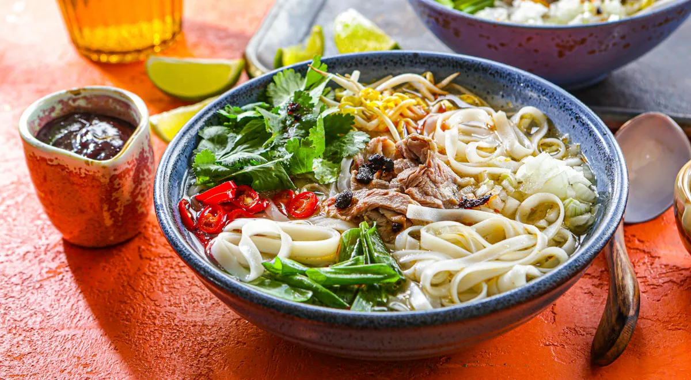

### Ориентировочные цены (Нячанг)

| Что | Цена, VND | ~ Руб. |
|---|---|---|
| Уличный фо / бань ми | 30–60 тыс. | 100–200 |
| Ужин в местном ресторане | 150–300 тыс. | 500–1000 |
| Ужин в туристическом ресторане | 300–600 тыс. | 1000–2000 |
| Кофе (ка-фе-суа-да) | 20–50 тыс. | 70–170 |
| Пиво местное (Saigon/Huda) | 15–40 тыс. | 50–130 |
| Свежий кокос | 20–30 тыс. | 70–100 |
| Морепродукты на двоих (лангуст и пр.) | 500–1200 тыс. | 1700–4000 |
| Массаж 60–90 мин | 250–500 тыс. | 800–1700 |
| Поездка Grab по городу | 30–80 тыс. | 100–270 |
| Такси аэропорт Камрань → Нячанг | 350–500 тыс. | 1200–1700 |
| Экскурсия на острова (снорклинг) | 400–800 тыс. | 1300–2700 |

---

## 4. Камрань и вокруг отеля

- **Radisson Blu Resort Cam Ranh** стоит на пляже **Бай Дай (Bai Dai / Long Beach)** — длинный песчаный пляж южнее города, тихо, малолюдно, вся инфраструктура в отеле.
- Вокруг мало «города»: ближайшие развлечения — поездки в Нячанг (45–60 мин) или трансферы отеля. Для спокойного пляжного отдыха — идеально.
- Рядом: поля **соляных промыслов Хон Хой (Hon Khoi Salt Fields)** — живописно на рассвете.
- Чуть дальше: бухта **Нинь Ван (Ninh Van Bay)**, «секретная» лагуна **Бинь Лап (Binh Lap)** — спокойная вода, снорклинг.
- Ближе к городу: грязевые источники **I-Resort**, **Thap Ba Hot Springs** и **100 Egg Mud Bath** — обязательная программа для расслабления.

---

## 5. Отель: Radisson Blu Resort Cam Ranh

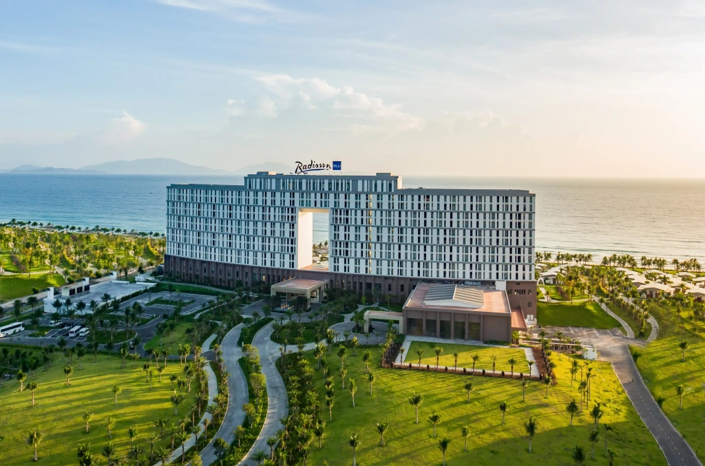

### Визитка

| | |
|---|---|
| Категория | 5★, beachfront-резорт |
| Пляж | Бай Дай (Long Beach), собственный участок |
| Номера | комнаты и виллы с видом на океан; есть виллы с собственным бассейном |
| Заселение / выезд | обычно 15:00 / 12:00 (сверь с ваучером) |
| Расстояния | аэропорт CXR ~15–20 мин, Нячанг ~45–60 мин |

### Что есть на территории

- **Бассейны** — большой главный бассейн-комплекс у моря (+ детская зона). Полотенца выдаются.
- **Пляж** — шезлонги и зонты бесплатно, вход пологий; сентябрь — возможны волны, купайся в отмеченной зоне.
- **Еда**: ресторан all-day, специализированный ресторан (стейк/морепродукты), пляжный бар, круглосуточный рум-сервис. Завтрак — шведский стол; включён он в тариф или нет — проверь в ваучере.
- **Спорт и SPA**: фитнес-зал, спа-центр с массажами, теннисные корты.
- **Детский клуб** Kids Club, **бесплатные велосипеды**, **бесплатный Wi-Fi** (ловит и на пляже).
- **Сервисы**: обмен валюты на ресепшене, экскурсионное бюро, прачечная, трансфер в аэропорт (заказ через консьержа), прокат водного инвентаря (кайт/SUP/каяки — сезонно, по запросу).

### Депозит при заселении

> **Депозит (залог) при чек-ине — да.** Размер: **1 000 000 VND за номер за ночь** (≈ $40–50). За 8 ночей наберётся ~8 млн VND (≈ $310) — наличными или блокировкой на иностранной карте. Сумма возвращается при выезде, если не было допрасходов. Держи наличные доллары под рукой (карты РФ не подходят), возьми чек/квитанцию о депозите и не выбрасывай до выезда. Точный способ оплаты уточни на ресепшене при заселении.

### Практические советы

- Спроси на ресепшене расписание **шаттла в Нячанг** — у резорта бывают рейсы по расписанию, дешевле такси.
- Шезлонги у бассейна занимают с утра — для «спокойного» места приходи до 09:00.
- Полотенца по карточкам — не потеряй карточку (иначе спишут с депозита).
- В номере чайник/вода; пить — бутилированную воду (бесплатная в номере пополняется ежедневно).
- Персонал говорит по-английски; в приложении переводчик (раздел 10) пригодится на всякий случай.

---

## 6. Нячанг: что посетить

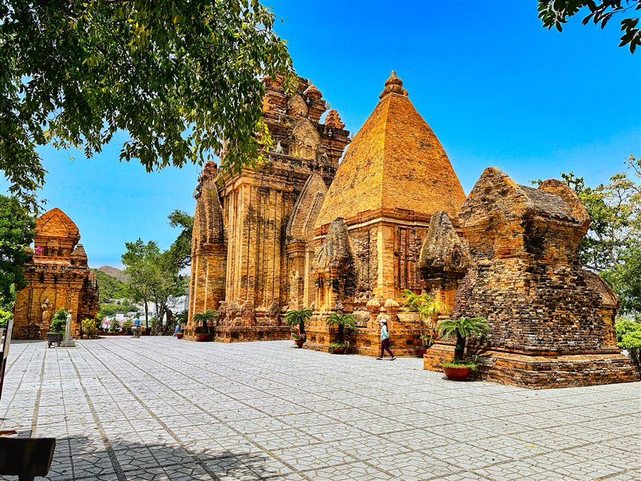

**Город (полдня–день, с трансфером из отеля):**
- **Башни По Нагар (Po Nagar)** — храмовый комплекс чамов VII–XII вв., ~30 тыс. VND. Главная достопримечательность.
- **Пагода Лонг Шон (Long Son)** — белый Будда, сидящий на холме, вход бесплатный.
- **Кафедральный собор (Christ the King Cathedral)** — на холме, красивая готика.
- **Океанографический музей (Nha Trang Oceanography Institute)** — аквариум, скелет кита.
- **Музей Александра Йерсена** — интересный, если любишь историю науки.
- **Башня Трам Хуонг (Trầm Hương Tower)** и променад по **ул. Чан Фу (Tran Phu)** — главная набережная города, вечерняя прогулка.
- **Рынок Дам (Cho Dam)** и **ночной рынок Нячанга** — фрукты, сувениры, уличная еда.

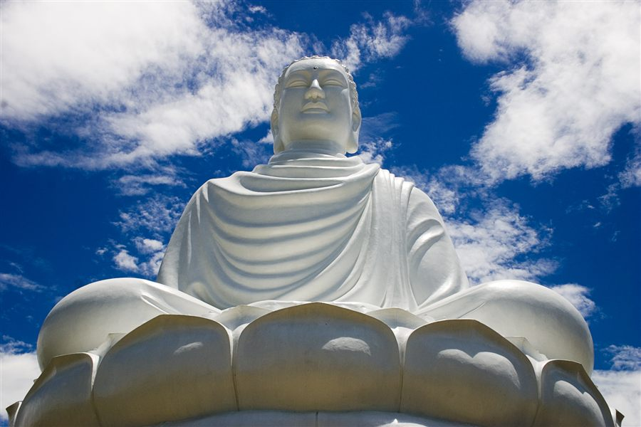

**Острова (снорклинг/лодочные туры):**
- **Хон Мун (Hon Mun)** — морской заповедник, лучший снорклинг.
- **Хон Там (Hon Tam)** — пляжный остров, лежаки, спокойное море.
- **Винперл / Хон Че (VinWonders)** — парк развлечений + канатная дорога через море (~3 км, самая длинная морская канатная дорога). Если хочешь день «не только пляж».

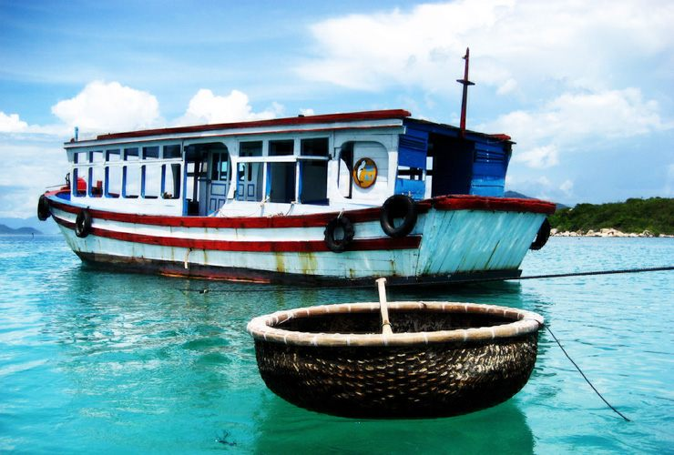

**Природа:**
- Водопады **Ба Хо (Ba Ho)** — купание в каскадах, ~25 км от города.
- Пляж **Док Лет (Doc Let)** — белый песок, мелкое море, ~50 км на север.

---

## 7. Где погулять

- **Променад Тран Фу** вечером — светящиеся фонтаны, уличные артисты, мороженое; главное место вечерних прогулок.
- **Парк Йерсена** у моря и площадь с башней Трам Хуонг.
- **Ночной рынок** (центр) — атмосферно после заката.
- **Район европейского квартала** (улицы Hung Vuong, Nguyen Thien Thuat) — кафе и рестораны.
- Вокруг отеля: сам пляж Бай Дай — километры песка, прогулки на закате.

---

## 8. Передвижение и Grab

### 8.1. Что такое Grab

**Grab** — это «Uber» Юго-Восточной Азии, во Вьетнаме это приложение №1. Через него заказываешь:
- **GrabCar** — обычная машина (кондиционер, безопасно);
- **GrabBike** — мотобайк (дешевле всего, шлем даёт водитель; если ты один и без багажа — самый быстрый способ);
- **GrabFood / GrabMart** — доставка еды и товаров из магазинов.

**Зачем он нужен:** цена фиксируется в приложении **до** поездки, водителя видно на карте, маршрут записан, никто не «накручивает» счётчик и не возит кругами. Уличное такси в Нячанге часто заламывает цену туристам — Grab это решает.

### 8.2. Как настроить (по шагам)

1. **Скачай Grab** из App Store / Google Play. Из России магазин может не отдавать приложение — тогда качай после прилёта через местный интернет (или заранее через VPN).
2. **Регистрация:** нужен номер телефона, на который придёт SMS-код.
   - Лучший вариант: местная вьетнамская SIM (если брал её) — код придёт на неё.
   - eSIM данных (Airalo) **не имеет номера** — код не придёт. Тогда регистрируйся на российский номер, пока он ловит SMS (SMS-роуминг работает, даже если выключены мобильные данные — проверь, что роуминг включён в настройках).
3. **Оплата:** добавь «Cash» (наличные) — это основной способ во Вьетнаме. Иностранные карты в Grab привязываются плохо, а российские — не работают. После поездки платишь донгами ровно ту сумму, что показало приложение (сдачи у водителей часто нет — носи купюры помельче).
4. **Интерфейс** (главный экран после регистрации):
   - сверху поле «Where are you going?» — пиши место назначения. Русского нет, но есть **английский** интерфейс: отель лучше вводить как «Radisson Blu Resort Cam Ranh» или вставлять точку из Google Maps;
   - ниже строка «From» — точка подачи. По умолчанию — текущая геопозиция. Проверь, что пин стоит у входа в отель, а не на пляже сзади;
   - внизу — переключатель вкладок: **Car / Bike / Food** и др. Для каждого показана цена заранее (например «₫ 210 000»);
   - жмёшь **Book** — и видишь карту с машиной, номером и фото водителя;
   - после поездки приложение предложит чаевые (можно скипнуть) и оценку.

**Официальные скриншоты Grab** (из App Store; в реальности порядок экранов такой: поле назначения → выбор тарифа с ценой → поиск водителя на карте → машина едет → поездка → оплата):

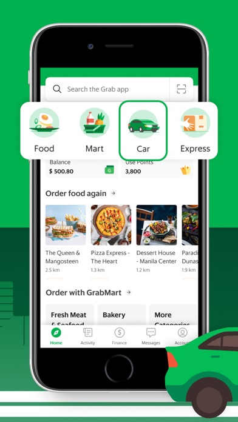 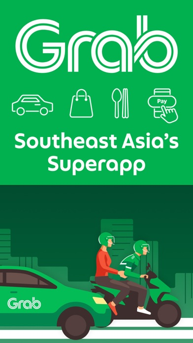 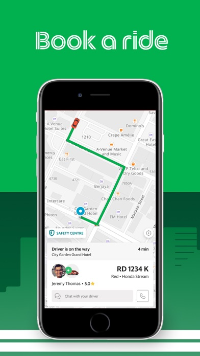 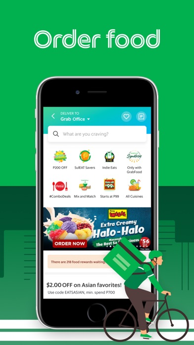 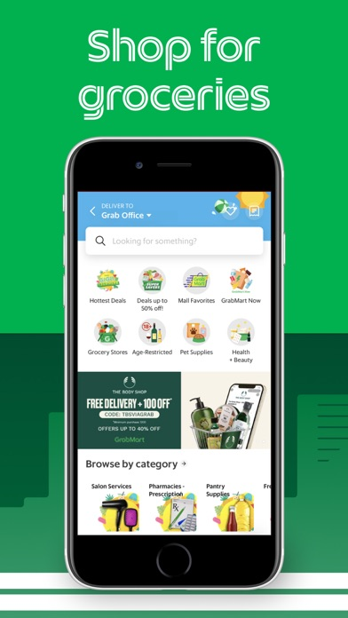  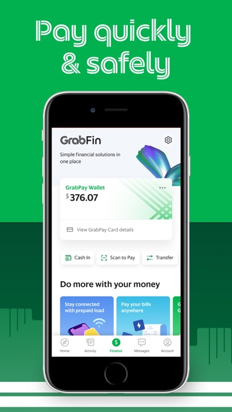

5. **Чат с водителем** — внутри приложения есть автоперевод. Полезная фраза: «I'm at the main lobby» / «Tôi ở sảnh chính» (той о шань тинь).

### 8.3. Цены и логистика из Radisson Blu (Бай Дай)

| Маршрут | GrabCar, VND | ~ Руб. | Время |
|---|---|---|---|
| Аэропорт Камрань (CXR) → отель | ~200–300 тыс. | 700–1000 | 15–20 мин |
| Отель → центр Нячанга | ~300–450 тыс. | 1000–1500 | 45–60 мин |
| По Нячангу (внутри города) | 30–80 тыс. | 100–270 | 5–20 мин |
| Отель → I-Resort / грязевые ванны | ~250–350 тыс. | 800–1200 | 30–40 мин |

- **Трансфер отеля** Радиссона (если заказывать у консьержа) обычно дороже Grab в 1.5–2 раза, но машину подадут точно ко времени — удобно для вылета рано утром.
- **Grab в аэропорту работает:** после выхода — зона ожидания Grab (обычно чуть дальше выхода, есть указатели). Или проще: закажи трансфер отеля заранее — после 10+ часов полёта это комфортнее.
- Если планируешь пару дней подряд в Нячанге — водители GrabCar охотно договариваются на «туда-обратно» за наличные мимо приложения (торгуйся: круг ~700 тыс. VND).

### 8.4. Альтернативы Grab

- **Xanh SM** — такси на электромобилях VinFast, во Вьетнаме очень популярно, приложение на английском, оплата наличными, цены сравнимы с Grab. Хороший запасной вариант.
- **Be** — второй по популярности агрегатор, часто чуть дешевле Grab. Интерфейс местами на вьетнамском.
- **Такси по счётчику:** Mai Linh (зелёные) и Vinasun (белые). Внутри города нормально; на дальние (отель→аэропорт) заранее договаривайся о фиксированной цене.
- **Мотобайк в аренду:** 120–200 тыс. VND/день, нужны права (международные для мотокатегории) и шлем. Полиция в Нячанге иногда устраивает проверки у туристов — если нет прав, рискуешь штрафом. Для спокойного отдыха лучше Grab.
- **Шаттлы отеля:** спроси на ресепшн про бесплатные/платные шаттлы в Нячанг — у резортов Бай Дай такое бывает по расписанию.

---

## 9. Связь (eSIM)

**Вариант 1 — eSIM (рекомендую, если телефон поддерживает eSIM):**
- **Airalo — Вьетнам (сеть VNPT):** безлимит 7 дней — **$27**, 10 дней — **$34.50**, 15 дней — **$48**. Купить и установить заранее из дома; интернет включится по прилёту. На 8 дней подходит пакет на 10 дней.
- Альтернативы: Holafly, Yesim, Drimsim (у Drimsim оплата по мегабайтам — выгодно, если интернет нужен редко).
- Данные в основном без звонков — звонки через WhatsApp/Telegram.

**Вариант 2 — местная SIM (дешевле):**
- В аэропорту Камрань или салонах **Viettel / Vinaphone / Mobifone**: ~250–400 тыс. VND (~800–1300 руб.) за 30 дней с ~5–10 ГБ/день или безлимитом.
- Нужен паспорт для регистрации. Viettel ловит лучше всех, в т.ч. на островах.

**Важно:** карты, банки и мессенджеры через российский номер — оставь роуминг основной SIM выключенным, включи «данные только через eSIM». VPN для части привычных сервисов может пригодиться, но заблокированных сайтов во Вьетнаме минимум.

---

## 10. Переводчик (русский ↔ вьетнамский)

**Главный инструмент — Google Translate** (бесплатно, поддерживает вьетнамский отлично):

1. **Офлайн-пакет.** Скачай вьетнамский пакет заранее (в приложении: Настройки → Офлайн-перевод → Вьетнамский). Тогда перевод текста и камеры работает даже без интернета.
2. **Камера.** Наводишь на меню/вывеску/упаковку — текст переводится прямо на экране. Во Вьетнаме без этого меню не прочитать. Тот же трюк умеет **Google Lens** (есть встроенная иконка в Google Translate).
3. **Режим разговора.** Говоришь по-русски — телефон произносит по-вьетнамски, и наоборот. Идеально для такси, рынка, аптеки. Покажи экран продавцу, если шумно.
4. **Фраза для старта диалога:** переведи заранее «Подскажите, пожалуйста…» и показывай результат собеседнику.

**Запасные варианты:**
- **Yandex Translate** — интерфейс на русском, хорошее качество для пары русский–вьетнамский. Работает и за границей.
- **Microsoft Translator** — тоже поддерживает пару RU↔VI, есть офлайн-пакеты и режим разговора.
- **DeepL НЕ подходит** — вьетнамского в нём нет.

**Лайфхаки:**
- В туристических местах Нячанга многие знают базовый английский, но на рынках и в маленьких кафе без переводчика сложно.
- Установи и проверь приложение **до вылета**: дай ему доступ к камере и микрофону заранее.
- Во время поездки на байке/такси просто показывай экран с переводом — это принято и никто не удивляется.

---

## 11. Чек-лист перед вылетом

- [ ] Загранпаспорт: **срок действия не менее 6 месяцев** на дату въезда.
- [ ] Виза: для граждан РФ въезд без визы до 45 дней (проверь актуальность на сайте консульства перед вылетом).
- [ ] Наличные **USD** (купюры $50/$100, новые, без повреждений) + немного рублей про запас.
- [ ] eSIM куплен и установлен (или план купить SIM в аэропорту).
- [ ] Установить **Grab** и зарегистрироваться.
- [ ] Установить **Google Translate** и скачать офлайн-пакет вьетнамского.
- [ ] Копии документов в облако (паспорт, билеты, страховка).
- [ ] **Медицинская страховка** с покрытием Вьетнама (проверь, включены ли экстренные случаи — это требование въезда не всегда проверяют, но лучше иметь).
- [ ] Бронь отеля и обратный билет — распечатать/сохранить офлайн.
- [ ] Адаптер: во Вьетнаме розетки A/C/EU (220V) — российские вилки в основном подходят, но евро-розетки — да; переходник на всякий случай.
- [ ] Аптечка: пластыри, жаропонижающее, сорбенты, репеллент, SPF 50.
- [ ] Уточнить **время трансфера на вылет** (SU 295) у гида/ресепшена — 14 сентября.
- [ ] Лёгкий дождевик + сменная обувь.

---

## 12. Полезные фразы (вьетнамский)

| Русский | Вьетнамский | Как читать |
|---|---|---|
| Здравствуйте | Xin chào | син чао |
| Спасибо | Cảm ơn | кам он |
| Сколько стоит? | Bao nhiêu tiền? | бау ниеу тьен? |
| Слишком дорого | Đắt quá | дат куа |
| Вкусно | Ngon | нгон |
| Счёт, пожалуйста | Tính tiền | тинь тьен |
| Не остро | Không cay | хонг кай |

---

## 13. Прочее

- **Тайфуны** в сентябре редки, но возможны — следи за прогнозом; при штормовом предупреждении не купайся на диких пляжах (красные флаги).
- **Питьевая вода** — только бутилированная; лёд в нормальных кафе безопасен.
- **Торг** уместен на рынках и с уличными торговцами, не в магазинах с ценниками.
- Время: GMT+7, разница с Москвой +4 часа.
- Валюта в чаевых: чаевые не обязательны, но 20–50 тыс. VND горничной/официанту приветствуются.
- В сентябре мало туристов — цены на экскурсии и трансферы торгуются легче.

---

*Приятного путешествия! Chúc chuyến đi vui vẻ!*

